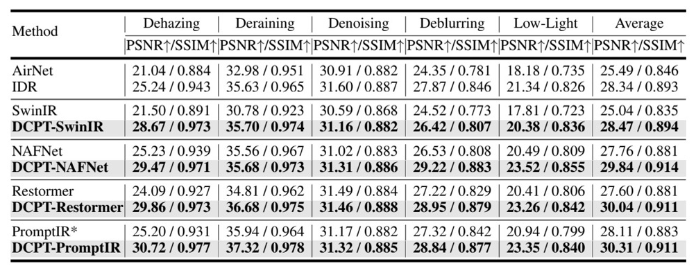
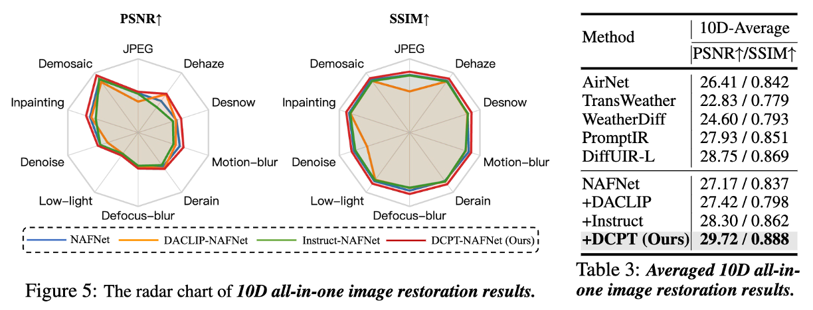
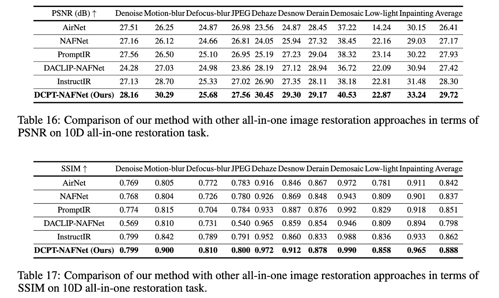
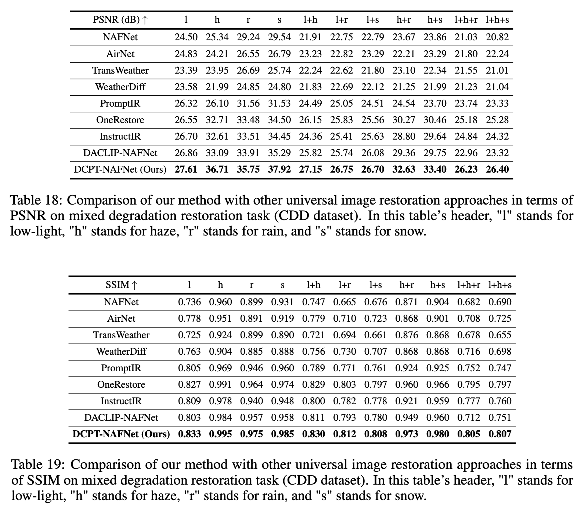

# Universal Image Restoration Pre-training via Degradation Classification ([ICLR 2025](https://openreview.net/forum?id=PacBhLzeGO))

[JiaKui Hu](https://scholar.google.com/citations?user=VagFt-sAAAAJ), [Zhengjian Yao](https://scholar.google.com/citations?user=D8rEFlEAAAAJ), [Lujia Jin](https://scholar.google.com/citations?user=-BWasB8AAAAJ), [Yanye Lu](https://scholar.google.com/citations?user=WSFToOMAAAAJ)*

MILab, Peking University

---

🚀️🚀️ **News:**

- 2025-1-23: Our paper was accepted by ICLR 2025.

- 2025-1-23: Release the inference scripts and pre-trained models of DCPT.

**TODO-lists:**

- [ ] Release the train scipts.
- [ ] Handle real-world mixed-degradation images.

## 1. Abstract

This paper proposes the Degradation Classification Pre-Training (DCPT), which enables models to learn how to classify the degradation type of input images for universal image restoration pre-training. Unlike the existing self-supervised pre-training methods, **DCPT utilizes the degradation type of the input image as an extremely weak supervision**, which can be effortlessly obtained, even intrinsic in all image restoration datasets. DCPT comprises two primary stages. Initially, image features are extracted from the encoder. Subsequently, a lightweight decoder, such as ResNet18, is leveraged to classify the degradation type of the input image solely based on the features extracted in the first stage, without utilizing the input image. The encoder is pre-trained with a straightforward yet potent DCPT, which is used to address universal image restoration and achieve outstanding performance. Following DCPT, both convolutional neural networks (CNNs) and transformers demonstrate performance improvements, with gains of up to **2.55 dB in the 10D all-in-one restoration task** and **6.53 dB in the mixed degradation scenarios**. Moreover, previous self-supervised pretraining methods, such as masked image modeling, discard the decoder after pre-training, while our DCPT utilizes the pre-trained parameters more effectively. This superiority arises from the degradation classifier acquired during DCPT, which facilitates transfer learning between models of identical architecture trained on diverse degradation types.

## 2. Results


<details>
<summary><strong>5D All-in-one Image Restoration</strong> (click to expand) </summary>



</details>

<details>
<summary><strong>10D All-in-one Image Restoration</strong> (click to expand) </summary>

Averaged:



PSNR and SSIM:



</details>

<details>
<summary><strong>Mixed Degradation Image Restoration</strong> (click to expand) </summary>



</details>

## 3. Quick Start

### Test

Clone via Github:

```shell
git clone https://github.com/MILab-PKU/dcpt.git
cd dcpt
```

You also can create a new environment to avoid conflicts:

```
conda env create -f environment.yml
```

Download [**pretrained models**](https://drive.google.com/drive/folders/17XKKgX3gbEWoma6ZQeRh8Dfazxy1iQpj?usp=drive_link), and put them in `./pretrained_models`.

To reproduce the results in our paper, please modify the dataset path and model path, then run:

```shell
BASICSR_JIT=True python basicsr/test.py -opt options/all_in_one/test/test_NAFNet_5d.yml
# you can modify the path of config file after `-opt`.
```

### KNN and T-SNE

```shell
python knn_gen.py # provide code is only for feature extraction of random initialized model.
python knn.py
python t_sne.py
```

### Pretrain

Coming soon.

### Train

Coming soon.

## Citation

If you find this repository useful, please consider giving a star ⭐ and citation.

```
@inproceedings{
hu2025universal,
title={Universal Image Restoration Pre-training via Degradation Classification},
author={Hu JiaKui, Zhengjian Yao, Jin Lujia, Lu Yanye},
booktitle={The Thirteenth International Conference on Learning Representations},
year={2025},
url={https://openreview.net/forum?id=PacBhLzeGO}
}
```

For help or issues using this git, please feel free to submit a GitHub issue.

For other communications related to this git, please contact `jkhu29@stu.pku.edu.cn`.
